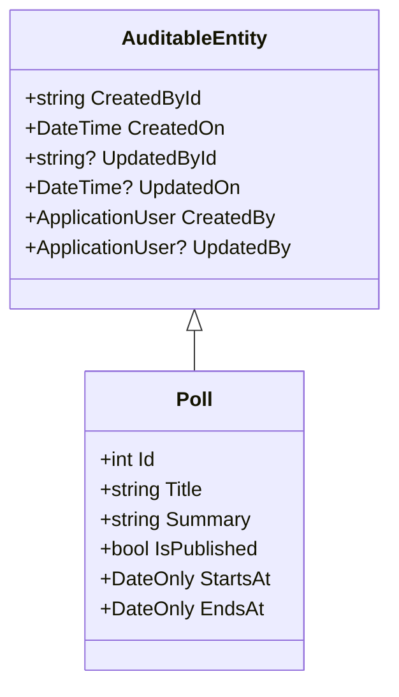
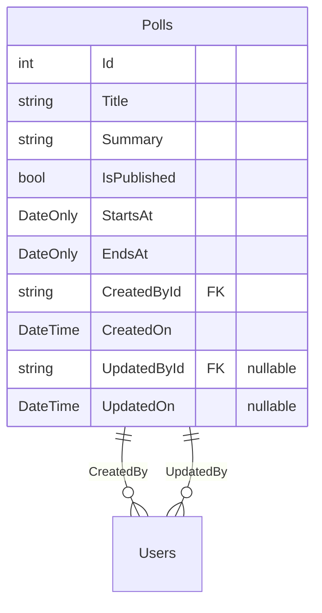
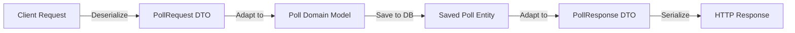

# Implementing Audit Properties in Entity Framework Core

## Overview
This document explains how to implement audit properties for entities in a .NET Core application using Entity Framework Core. We'll explore how to track creation and modification details for database records, including both the basic approach and an optimized solution using inheritance.

## Basic Structure
Let's start with a basic entity example showing the required audit properties:

```csharp
public sealed class Poll
{
    public int Id { get; set; }
    public string Title { get; set; } = string.Empty;
    public string Summary { get; set; } = string.Empty;
    public bool IsPublished { get; set; }
    public DateOnly StartsAt { get; set; }
    public DateOnly EndsAt { get; set; }
    
    // Audit Properties
    public string CreatedById { get; set; } = string.Empty;
    public DateTime CreatedOn { get; set; } = DateTime.UtcNow;
    public string? UpdatedById { get; set; }
    public DateTime? UpdatedOn { get; set; }
    public ApplicationUser CreatedBy { get; set; } = default!;
    public ApplicationUser? UpdatedBy { get; set; }
}
```

## Entity Configuration
The audit properties can be configured in the entity configuration class:

```csharp
public class PollConfiguration : IEntityTypeConfiguration<Poll>
{
    public void Configure(EntityTypeBuilder<Poll> builder)
    {
        builder.HasIndex(x => x.Title).IsUnique();
        builder.Property(x => x.Title).HasMaxLength(100);
        builder.Property(x => x.Summary).HasMaxLength(1500);

        // Audit property configuration
        builder.Property(x => x.CreatedOn)
            .HasDefaultValue(DateTime.UtcNow);
        // Alternative: Use database server time
        // builder.Property(x => x.CreatedOn)
        //     .HasDefaultValueSql("GETDATE()");
    }
}
```

## Optimized Approach Using Inheritance
To avoid duplicating audit properties across multiple entities, we can create a base class:



### Base Class Implementation
```csharp
public abstract class AuditableEntity
{
    public string CreatedById { get; set; } = string.Empty;
    public DateTime CreatedOn { get; set; } = DateTime.UtcNow;
    public string? UpdatedById { get; set; }
    public DateTime? UpdatedOn { get; set; }
    public ApplicationUser CreatedBy { get; set; } = default!;
    public ApplicationUser? UpdatedBy { get; set; }
}
```

### Inheriting the Base Class
```csharp
public sealed class Poll : AuditableEntity
{
    public int Id { get; set; }
    public string Title { get; set; } = string.Empty;
    public string Summary { get; set; } = string.Empty;
    public bool IsPublished { get; set; }
    public DateOnly StartsAt { get; set; }
    public DateOnly EndsAt { get; set; }
}
```

## Audit Properties Explained

| Property | Type | Description | Nullable |
|----------|------|-------------|-----------|
| CreatedById | string | ID of the user who created the record | No |
| CreatedOn | DateTime | Timestamp of record creation | No |
| UpdatedById | string | ID of the user who last modified the record | Yes |
| UpdatedOn | DateTime | Timestamp of last modification | Yes |
| CreatedBy | ApplicationUser | Navigation property to creator | No |
| UpdatedBy | ApplicationUser | Navigation property to last modifier | Yes |

## Benefits of Using Inheritance
1. Reduces code duplication
2. Centralizes audit logic
3. Makes maintenance easier
4. Ensures consistency across entities
5. Simplifies future modifications to audit properties

This approach follows the DRY (Don't Repeat Yourself) principle and provides a scalable solution for implementing audit trails in your application.


# Adding Audit Columns to an Existing Database: A Step-by-Step Guide

## Overview
When adding audit columns to an existing database table, especially when dealing with required foreign key relationships, careful consideration of existing data and migration strategy is essential. This guide walks through the process of adding audit columns to the Polls table and handling potential constraints.

## The Migration Challenge
When adding required foreign key columns to an existing table with data, we face a specific challenge: existing records cannot have NULL values in required columns. This becomes particularly important when adding columns like `CreatedById` that are both required and serve as foreign keys to the Users table.

## Solution Process

### 1. Generate the Migration
First, create the migration that will add the audit columns:

```bash
add-migration AddAuditColumnsToPollsTable
```

This command generates a migration file that will:
- Add the new audit columns (CreatedById, CreatedOn, UpdatedById, UpdatedOn)
- Create necessary indices
- Set up foreign key relationships

### 2. Handle Existing Data

Since we're still in development, we can take the straightforward approach of clearing existing data. In SQL Server Management Studio or your preferred database tool, execute:

```sql
-- Clear all existing records from the Polls table
DELETE FROM Polls;

-- Reset the identity counter to start from 1 again
DBCC CHECKIDENT ('Polls', RESEED, 0);
```

> ⚠️ **Important Note**: This approach is only suitable during development. In a production environment, you would need to:
> 1. Create a data migration strategy
> 2. Prepare default values for the new required columns
> 3. Possibly create a temporary table for data preservation

### 3. Apply the Migration
After clearing the existing data, apply the migration:

```bash
update-database
```

The migration should now complete successfully, adding the following columns:
- `CreatedById` (required, foreign key to Users)
- `CreatedOn` (required, timestamp)
- `UpdatedById` (nullable, foreign key to Users)
- `UpdatedOn` (nullable, timestamp)

## Database Schema Changes



## Next Steps
The next phase involves implementing the logic to automatically populate these audit columns based on the entity's state. This includes:
1. Capturing the current user's ID for new records
2. Recording creation timestamp
3. Tracking updates with user ID and timestamp
4. Implementing this logic consistently across all database operations

> 🔍 **Best Practice**: Consider implementing this logic at a lower level (like a base repository or through EF Core interceptors) to ensure consistent auditing across all entities.

This documentation will be expanded to include the implementation details of audit value assignment in the next section.


# Implementing Automatic Audit Trail in Entity Framework Core

## Overview
This guide explains how to implement automatic audit trail tracking in Entity Framework Core by overriding the `SaveChangesAsync` method in your `DbContext`. This approach automatically captures who created or modified records and when these changes occurred.

## Implementation

Here's how we implement automatic audit tracking in our `ApplicationDbContext`:

```csharp
public class ApplicationDbContext : IdentityDbContext<ApplicationUser>
{
    private readonly IHttpContextAccessor _httpContextAccessor;

    public ApplicationDbContext(
        DbContextOptions<ApplicationDbContext> options,
        IHttpContextAccessor httpContextAccessor) 
        : base(options)
    {
        _httpContextAccessor = httpContextAccessor;
    }

    public DbSet<Poll> Polls { get; set; }

    public override Task<int> SaveChangesAsync(CancellationToken cancellationToken = default)
    {
        // Get all entities being tracked that inherit from AuditableEntity
        var entries = ChangeTracker.Entries<AuditableEntity>();

        foreach (var entityEntry in entries)
        {
            // Get the current user's ID from the HTTP context
            var currentUserId = _httpContextAccessor.HttpContext?.User
                .FindFirstValue(ClaimTypes.NameIdentifier)!;

            if (entityEntry.State == EntityState.Added)
            {
                // Set audit properties for new entities
                entityEntry.Property(x => x.CreatedById).CurrentValue = currentUserId;
                entityEntry.Property(x => x.CreatedOn).CurrentValue = DateTime.UtcNow;
            }
            else if (entityEntry.State == EntityState.Modified)
            {
                // Set audit properties for modified entities
                entityEntry.Property(x => x.UpdatedById).CurrentValue = currentUserId;
                entityEntry.Property(x => x.UpdatedOn).CurrentValue = DateTime.UtcNow;
            }
        }

        return base.SaveChangesAsync(cancellationToken);
    }
}
```

## Understanding the Current User ID Retrieval

Let's break down this crucial line of code:

```csharp
var currentUserId = _httpContextAccessor.HttpContext?.User.FindFirstValue(ClaimTypes.NameIdentifier)!;
```

This line is composed of several parts:

1. `_httpContextAccessor`: An interface that provides access to the current HTTP context
2. `.HttpContext?`: Safely accesses the current HTTP context (null if no HTTP context exists)
3. `.User`: Accesses the ClaimsPrincipal object representing the current user
4. `.FindFirstValue(ClaimTypes.NameIdentifier)`: Searches for and returns the value of the first claim of type "NameIdentifier"
5. `!`: Null-forgiving operator indicating we expect this value to be non-null

Here's a visual representation of the process:


## How It Works

1. **Entity Tracking**:
   - The `ChangeTracker.Entries<AuditableEntity>()` method returns only entities that inherit from `AuditableEntity`
   - This ensures we only process entities that need audit information

2. **State Detection**:
   - For new entities (`EntityState.Added`):
     ```csharp
     entityEntry.Property(x => x.CreatedById).CurrentValue = currentUserId;
     entityEntry.Property(x => x.CreatedOn).CurrentValue = DateTime.UtcNow;
     ```
   - For modified entities (`EntityState.Modified`):
     ```csharp
     entityEntry.Property(x => x.UpdatedById).CurrentValue = currentUserId;
     entityEntry.Property(x => x.UpdatedOn).CurrentValue = DateTime.UtcNow;
     ```

3. **Automatic Tracking**:
   - This implementation requires no explicit calls to set audit properties
   - Works automatically whenever `SaveChangesAsync` is called
   - Maintains consistency across all database operations

## Important Considerations

1. **User Context**:
   - The implementation assumes the user is authenticated
   - The HTTP context must be available
   - The user must have a valid NameIdentifier claim

2. **UTC Time**:
   - All timestamps are stored in UTC (DateTime.UtcNow)
   - This ensures consistent time tracking across different time zones

3. **Null Safety**:
   - The code uses null-conditional operators (?.) for safe navigation
   - The null-forgiving operator (!) should be used carefully and with confidence that the value won't be null

Understanding this implementation helps ensure proper audit trailing throughout your application while maintaining clean and maintainable code.


# Modifying API Controller Response with Mapster

## Overview
This guide explains how to modify an API controller's Add endpoint to return a specific response type using Mapster for object mapping, rather than exposing domain models directly in the API response.

## Implementation

Here's the modified controller endpoint:

```csharp
[HttpPost("")]
public async Task<IActionResult> Add(
    [FromBody] PollRequest request,
    CancellationToken cancellationToken)
{
    // Transform request DTO to domain model
    var pollToCreate = request.Adapt<Poll>();

    // Create new poll in database
    var createdPoll = await _pollService.AddAsync(pollToCreate, cancellationToken);

    // Transform domain model to response DTO and return
    return CreatedAtAction(
        actionName: nameof(Get),
        routeValues: new { id = createdPoll.Id },
        value: createdPoll.Adapt<PollResponse>()
    );
}
```

## Data Flow
The data transformation process follows a clear path through the system:



## Understanding the Response

When the endpoint is called, it returns an HTTP response with:
1. Status code 201 (Created)
2. Location header pointing to the new resource
3. Response body containing the mapped PollResponse

Example HTTP Response:
```http
HTTP/1.1 201 Created
Location: /api/polls/123
Content-Type: application/json

{
    "id": 123,
    "title": "Sample Poll",
    "summary": "Poll description",
    // Other fields defined in PollResponse
}
```

## Benefits of This Approach

### 1. Separation of Concerns
- Domain models remain isolated from API contracts
- Changes to internal models don't necessarily affect API consumers
- Better control over what data is exposed

### 2. API Contract Management
- Clear, documented API responses
- Consistent response structure
- Ability to version API responses independently of domain models

### 3. Security
- Prevents accidental exposure of sensitive data
- Allows fine-grained control over exposed properties
- Reduces attack surface by limiting exposed information

## Code Breakdown

Let's examine each part of the implementation:

1. **Request Processing**:
```csharp
var pollToCreate = request.Adapt<Poll>();
```
Transforms the incoming DTO into our domain model, mapping only the properties we need for creation.

2. **Service Call**:
```csharp
var createdPoll = await _pollService.AddAsync(pollToCreate, cancellationToken);
```
Handles the actual business logic and database operation.

3. **Response Creation**:
```csharp
return CreatedAtAction(
    actionName: nameof(Get),
    routeValues: new { id = createdPoll.Id },
    value: createdPoll.Adapt<PollResponse>()
);
```
Creates a REST-compliant response with:
- The correct HTTP status code
- A Location header for resource retrieval
- A transformed response body

## Best Practices

1. **Model Mapping**:
   - Define clear mapping configurations
   - Keep DTOs focused on their specific use cases
   - Validate incoming data before mapping

2. **Response Structure**:
   - Keep responses consistent across endpoints
   - Include only necessary data
   - Document response structures in API documentation

3. **Error Handling**:
   - Add appropriate try-catch blocks
   - Return proper error responses
   - Log mapping failures for debugging

## Next Steps
Consider implementing:
1. Response type validation
2. Custom mapping configurations
3. API versioning support
4. Response compression
5. Caching headers

This implementation provides a solid foundation for building maintainable and secure API endpoints while following REST best practices.
