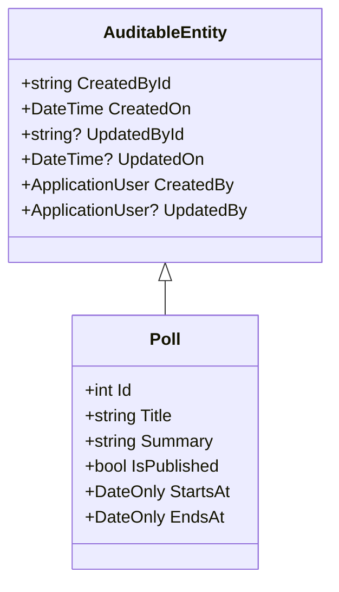
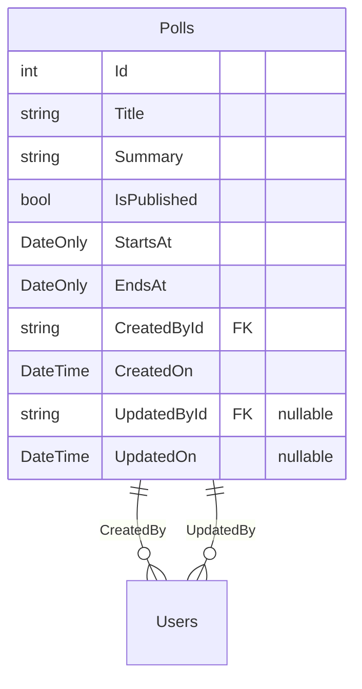

# Implementing Audit Properties in Entity Framework Core

## Overview
This document explains how to implement audit properties for entities in a .NET Core application using Entity Framework Core. We'll explore how to track creation and modification details for database records, including both the basic approach and an optimized solution using inheritance.

## Basic Structure
Let's start with a basic entity example showing the required audit properties:

```csharp
public sealed class Poll
{
    public int Id { get; set; }
    public string Title { get; set; } = string.Empty;
    public string Summary { get; set; } = string.Empty;
    public bool IsPublished { get; set; }
    public DateOnly StartsAt { get; set; }
    public DateOnly EndsAt { get; set; }
    
    // Audit Properties
    public string CreatedById { get; set; } = string.Empty;
    public DateTime CreatedOn { get; set; } = DateTime.UtcNow;
    public string? UpdatedById { get; set; }
    public DateTime? UpdatedOn { get; set; }
    public ApplicationUser CreatedBy { get; set; } = default!;
    public ApplicationUser? UpdatedBy { get; set; }
}
```

## Entity Configuration
The audit properties can be configured in the entity configuration class:

```csharp
public class PollConfiguration : IEntityTypeConfiguration<Poll>
{
    public void Configure(EntityTypeBuilder<Poll> builder)
    {
        builder.HasIndex(x => x.Title).IsUnique();
        builder.Property(x => x.Title).HasMaxLength(100);
        builder.Property(x => x.Summary).HasMaxLength(1500);

        // Audit property configuration
        builder.Property(x => x.CreatedOn)
            .HasDefaultValue(DateTime.UtcNow);
        // Alternative: Use database server time
        // builder.Property(x => x.CreatedOn)
        //     .HasDefaultValueSql("GETDATE()");
    }
}
```

## Optimized Approach Using Inheritance
To avoid duplicating audit properties across multiple entities, we can create a base class:



### Base Class Implementation
```csharp
public abstract class AuditableEntity
{
    public string CreatedById { get; set; } = string.Empty;
    public DateTime CreatedOn { get; set; } = DateTime.UtcNow;
    public string? UpdatedById { get; set; }
    public DateTime? UpdatedOn { get; set; }
    public ApplicationUser CreatedBy { get; set; } = default!;
    public ApplicationUser? UpdatedBy { get; set; }
}
```

### Inheriting the Base Class
```csharp
public sealed class Poll : AuditableEntity
{
    public int Id { get; set; }
    public string Title { get; set; } = string.Empty;
    public string Summary { get; set; } = string.Empty;
    public bool IsPublished { get; set; }
    public DateOnly StartsAt { get; set; }
    public DateOnly EndsAt { get; set; }
}
```

## Audit Properties Explained

| Property | Type | Description | Nullable |
|----------|------|-------------|-----------|
| CreatedById | string | ID of the user who created the record | No |
| CreatedOn | DateTime | Timestamp of record creation | No |
| UpdatedById | string | ID of the user who last modified the record | Yes |
| UpdatedOn | DateTime | Timestamp of last modification | Yes |
| CreatedBy | ApplicationUser | Navigation property to creator | No |
| UpdatedBy | ApplicationUser | Navigation property to last modifier | Yes |

## Benefits of Using Inheritance
1. Reduces code duplication
2. Centralizes audit logic
3. Makes maintenance easier
4. Ensures consistency across entities
5. Simplifies future modifications to audit properties

This approach follows the DRY (Don't Repeat Yourself) principle and provides a scalable solution for implementing audit trails in your application.


# Adding Audit Columns to an Existing Database: A Step-by-Step Guide

## Overview
When adding audit columns to an existing database table, especially when dealing with required foreign key relationships, careful consideration of existing data and migration strategy is essential. This guide walks through the process of adding audit columns to the Polls table and handling potential constraints.

## The Migration Challenge
When adding required foreign key columns to an existing table with data, we face a specific challenge: existing records cannot have NULL values in required columns. This becomes particularly important when adding columns like `CreatedById` that are both required and serve as foreign keys to the Users table.

## Solution Process

### 1. Generate the Migration
First, create the migration that will add the audit columns:

```bash
add-migration AddAuditColumnsToPollsTable
```

This command generates a migration file that will:
- Add the new audit columns (CreatedById, CreatedOn, UpdatedById, UpdatedOn)
- Create necessary indices
- Set up foreign key relationships

### 2. Handle Existing Data

Since we're still in development, we can take the straightforward approach of clearing existing data. In SQL Server Management Studio or your preferred database tool, execute:

```sql
-- Clear all existing records from the Polls table
DELETE FROM Polls;

-- Reset the identity counter to start from 1 again
DBCC CHECKIDENT ('Polls', RESEED, 0);
```

> ⚠️ **Important Note**: This approach is only suitable during development. In a production environment, you would need to:
> 1. Create a data migration strategy
> 2. Prepare default values for the new required columns
> 3. Possibly create a temporary table for data preservation

### 3. Apply the Migration
After clearing the existing data, apply the migration:

```bash
update-database
```

The migration should now complete successfully, adding the following columns:
- `CreatedById` (required, foreign key to Users)
- `CreatedOn` (required, timestamp)
- `UpdatedById` (nullable, foreign key to Users)
- `UpdatedOn` (nullable, timestamp)

## Database Schema Changes



## Next Steps
The next phase involves implementing the logic to automatically populate these audit columns based on the entity's state. This includes:
1. Capturing the current user's ID for new records
2. Recording creation timestamp
3. Tracking updates with user ID and timestamp
4. Implementing this logic consistently across all database operations

> 🔍 **Best Practice**: Consider implementing this logic at a lower level (like a base repository or through EF Core interceptors) to ensure consistent auditing across all entities.

This documentation will be expanded to include the implementation details of audit value assignment in the next section.
