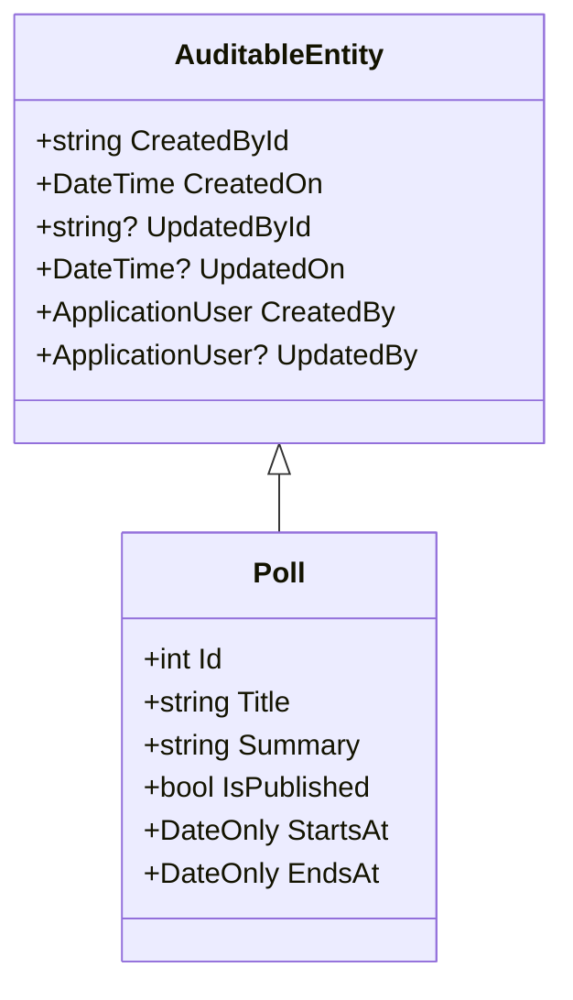

# Implementing Audit Properties in Entity Framework Core

## Overview
This document explains how to implement audit properties for entities in a .NET Core application using Entity Framework Core. We'll explore how to track creation and modification details for database records, including both the basic approach and an optimized solution using inheritance.

## Basic Structure
Let's start with a basic entity example showing the required audit properties:

```csharp
public sealed class Poll
{
    public int Id { get; set; }
    public string Title { get; set; } = string.Empty;
    public string Summary { get; set; } = string.Empty;
    public bool IsPublished { get; set; }
    public DateOnly StartsAt { get; set; }
    public DateOnly EndsAt { get; set; }
    
    // Audit Properties
    public string CreatedById { get; set; } = string.Empty;
    public DateTime CreatedOn { get; set; } = DateTime.UtcNow;
    public string? UpdatedById { get; set; }
    public DateTime? UpdatedOn { get; set; }
    public ApplicationUser CreatedBy { get; set; } = default!;
    public ApplicationUser? UpdatedBy { get; set; }
}
```

## Entity Configuration
The audit properties can be configured in the entity configuration class:

```csharp
public class PollConfiguration : IEntityTypeConfiguration<Poll>
{
    public void Configure(EntityTypeBuilder<Poll> builder)
    {
        builder.HasIndex(x => x.Title).IsUnique();
        builder.Property(x => x.Title).HasMaxLength(100);
        builder.Property(x => x.Summary).HasMaxLength(1500);

        // Audit property configuration
        builder.Property(x => x.CreatedOn)
            .HasDefaultValue(DateTime.UtcNow);
        // Alternative: Use database server time
        // builder.Property(x => x.CreatedOn)
        //     .HasDefaultValueSql("GETDATE()");
    }
}
```

## Optimized Approach Using Inheritance
To avoid duplicating audit properties across multiple entities, we can create a base class:



### Base Class Implementation
```csharp
public abstract class AuditableEntity
{
    public string CreatedById { get; set; } = string.Empty;
    public DateTime CreatedOn { get; set; } = DateTime.UtcNow;
    public string? UpdatedById { get; set; }
    public DateTime? UpdatedOn { get; set; }
    public ApplicationUser CreatedBy { get; set; } = default!;
    public ApplicationUser? UpdatedBy { get; set; }
}
```

### Inheriting the Base Class
```csharp
public sealed class Poll : AuditableEntity
{
    public int Id { get; set; }
    public string Title { get; set; } = string.Empty;
    public string Summary { get; set; } = string.Empty;
    public bool IsPublished { get; set; }
    public DateOnly StartsAt { get; set; }
    public DateOnly EndsAt { get; set; }
}
```

## Audit Properties Explained

| Property | Type | Description | Nullable |
|----------|------|-------------|-----------|
| CreatedById | string | ID of the user who created the record | No |
| CreatedOn | DateTime | Timestamp of record creation | No |
| UpdatedById | string | ID of the user who last modified the record | Yes |
| UpdatedOn | DateTime | Timestamp of last modification | Yes |
| CreatedBy | ApplicationUser | Navigation property to creator | No |
| UpdatedBy | ApplicationUser | Navigation property to last modifier | Yes |

## Benefits of Using Inheritance
1. Reduces code duplication
2. Centralizes audit logic
3. Makes maintenance easier
4. Ensures consistency across entities
5. Simplifies future modifications to audit properties

This approach follows the DRY (Don't Repeat Yourself) principle and provides a scalable solution for implementing audit trails in your application.
